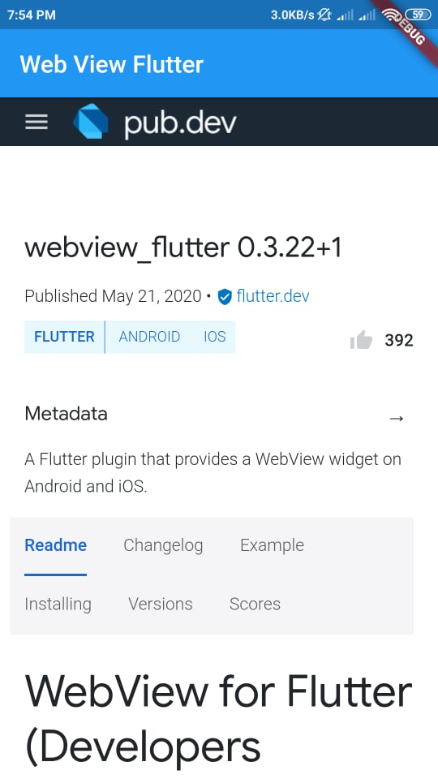

# Webview Flutter

This project is for learning how to use webview in Flutter App.

### Webview Package

```dart
dependencies:
  webview_flutter: ^0.3.22+1
```

```dart
$ flutter packages get
```

```dart
import 'package:webview_flutter/webview_flutter.dart';
```

### Webview Widget
```dart
WebView(
        debuggingEnabled: true,
        gestureNavigationEnabled: true,
        initialUrl: 'https://pub.dev/packages/webview_flutter',
        javascriptMode: JavascriptMode.unrestricted,
        initialMediaPlaybackPolicy: AutoMediaPlaybackPolicy.always_allow,
      )
```

## Screenshots

