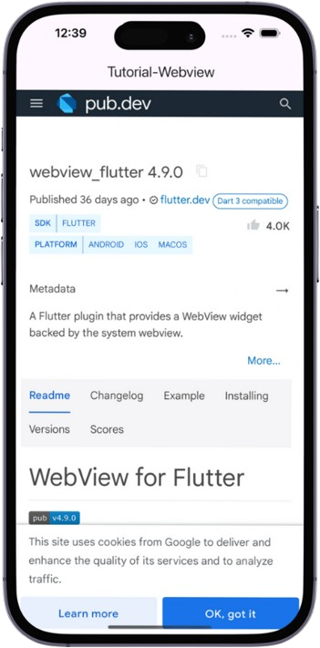

# Webview Flutter

This project is for learning how to use webview in Flutter App.

### initialize Webview
```dart
late WebViewController _controller;

void _initializeWebview() {
  late final PlatformWebViewControllerCreationParams params;
  params = const PlatformWebViewControllerCreationParams();
  final controller = WebViewController.fromPlatformCreationParams(params);
  controller
    ..setJavaScriptMode(JavaScriptMode.unrestricted)
    ..setBackgroundColor(const Color(0x00000000))
    ..setNavigationDelegate(NavigationDelegate(onPageFinished: (url) => setState(() => _loader = false)))
    ..addJavaScriptChannel('Toaster', onMessageReceived: (message) {})
    ..loadRequest(Uri.parse(widget.url));
  setState(() => _controller = controller);
}
```

### Webview Widget
```dart
WebView(
        debuggingEnabled: true,
        gestureNavigationEnabled: true,
        initialUrl: 'https://pub.dev/packages/webview_flutter',
        javascriptMode: JavascriptMode.unrestricted,
        initialMediaPlaybackPolicy: AutoMediaPlaybackPolicy.always_allow,
      )
```

## Screenshots

